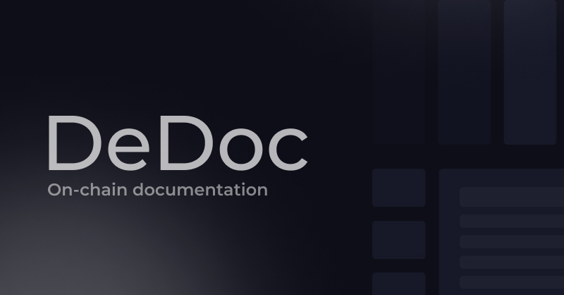

# DEDOC Web3 Notes App
- React app with React Router, Tailwind, DaisyUI and Solana Wallet Adapter.
- Shared SDK
- cNFTs as a framework for handling documentation updates. 
  
<hr>

## Develop
### We use `pnpm` for packages
1. Install node 20+ if you don't have it: https://nodejs.org/en
2. Install pnpm if you don't have it: `npm i -g pnpm`.
3. Install NX CLI if you don't have it: `pnpm i -g nx`.

### We use Nx to manage apps
https://nx.dev/getting-started/intro

### We use Railway for hosting
https://railway.app/

<hr>

## Development
Start apps by running `npx nx serve web`.

### Web App
To start the included React app run `npx nx serve web`.

### Lib
Shared utilities across apps such as types and functions in `./packages/sdk`.

**Usage**

`import { mint } from "@dedoc/sdk"`

### Add Apps
View the available NX generators here.
https://nx.dev/nx-api

<hr>

## Deploy
To deploy the included apps on a platform like Railway, we use the following settings:

### Static Web App
To deploy a static website like the React app, you can serve it like this.

**Build Command**
```
npx nx build web
```

**Watch Paths**
```
/apps/web
```

**Start Command**
```
npx http-server ./dist/apps/web
```

### Node App
To deploy a Node app like the API, you can directly start it like this.

**Build Command**
```
npx nx build api
```

**Watch Paths**
```
/apps/api
```

**Start Command**
```
node ./dist/apps/api
```
<hr>

# How DeDoc Works

When a new user visits DeDoc and signs in with their Solana wallet, they are greeted to create an account. 

This does the following for a user: 
 - Creates a collection NFT that all `Projects` will sit under. 
 - Sets up a config to allow for unlimited Projects to be added, for an extremely low cost of storage. 

Follow this, a user is prompted to create a project. Here, you are able to maintain and update your Project as you do a normal documentation-base. The difference is, this one is completely held on-chain, with updates taking place through Metaplex's new update functionality for cNFTs. 

After creating a project you can navigate into the editor, where you can make your changes and start building your documentation on-chain! 

Here are a list of things DeDoc handles:
 - Hosting for docs to be viewed by the public. 
 - Economic storage model to keep costs low for users. 
 - Ability to update docs in real time on-chain.

# FAQ 

## Do I own my assets created on DeDoc? 
Yes, any user who creates an account and subsequent projects have full authority over those on-chain assets. 

## How can I host my documentation elsewhere? 
It's easier said than done, but looking at our preset model for creating, displaying, and updating pages should be thoroughly looked at if you plan on hosting your own version. 

## How much does DeDoc cost? 
At the moment, there is no vendor cost for creating, storing, and uploading your documentation on-chain. However, you will be responsilble for paying the on-chain fees associated with the creation of any asset. 

## I have other questions, where is the best place to ask? 

Join our server, [Ru Labs](https://discord.gg/pyjAVAqSbX),  if you have any questions or need any support. 
